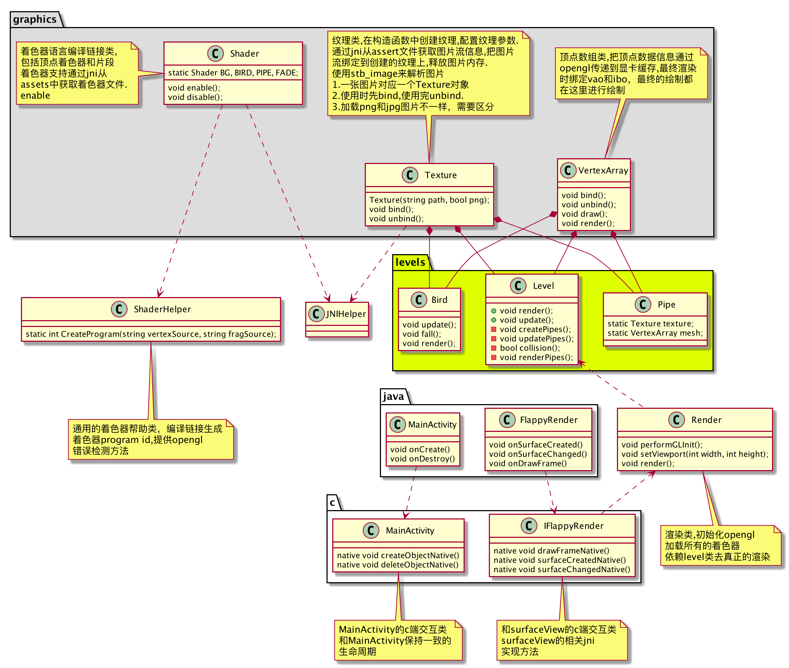
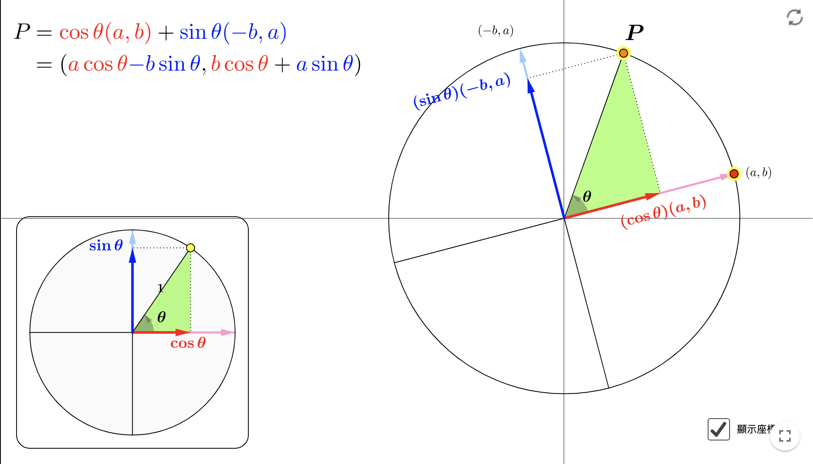
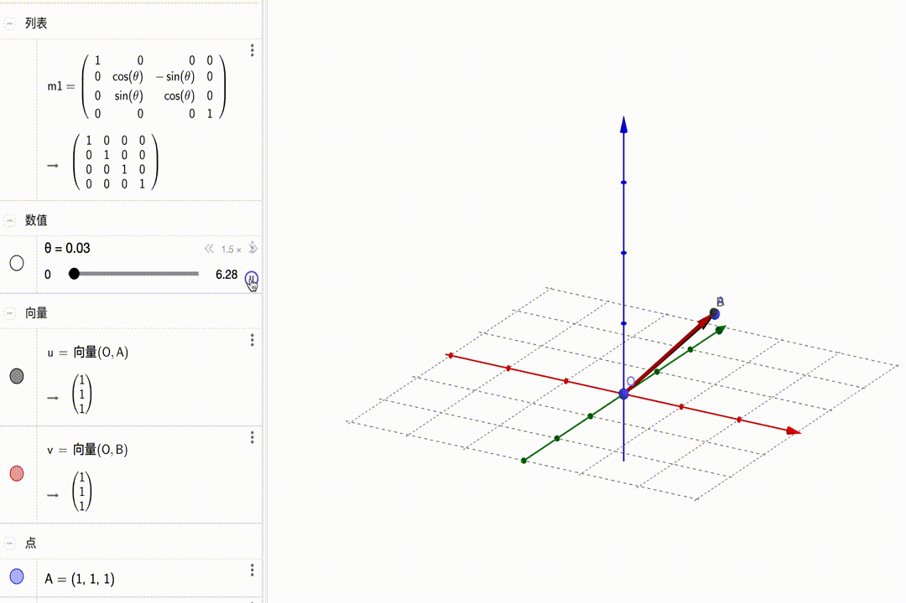
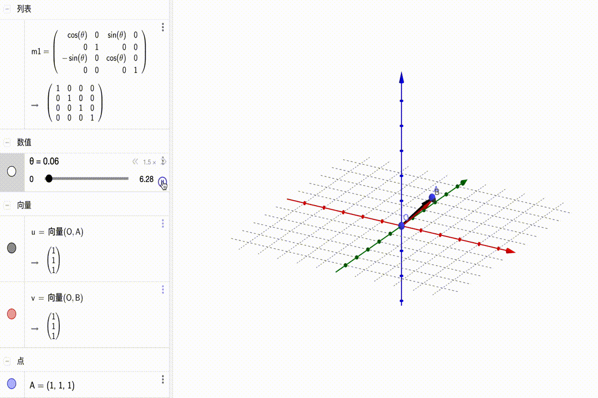
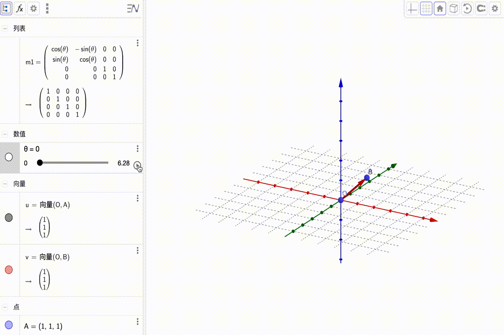
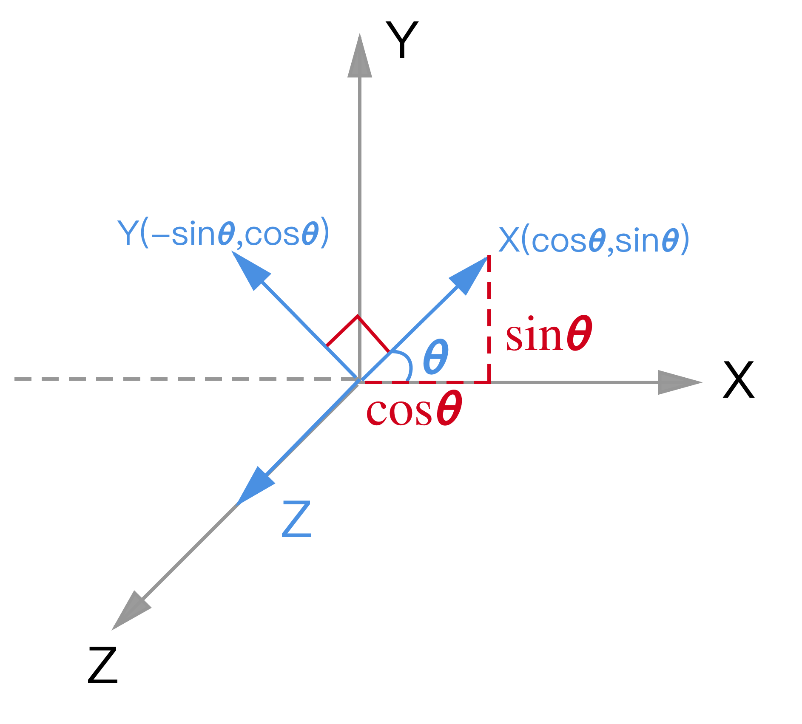
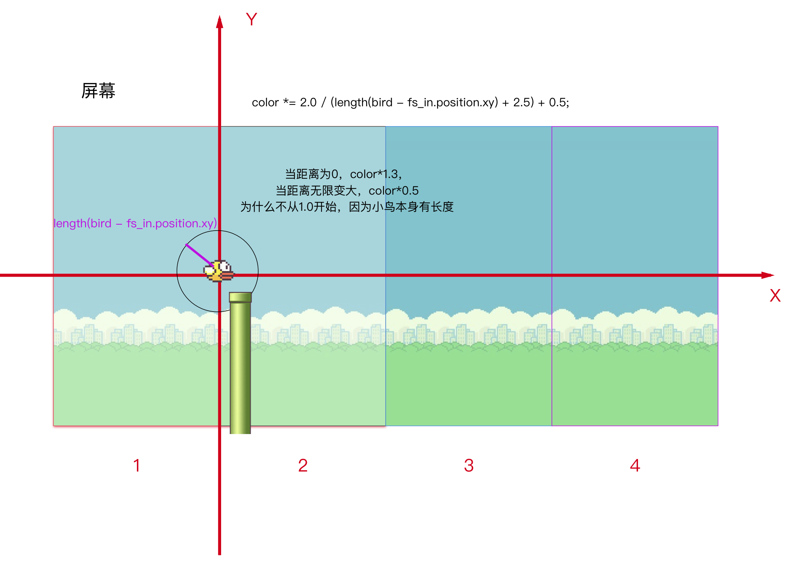

# Flappy

## OpenGL

*Open Graphics Library*开放式图形库是用于渲染2D、3D矢量图形的跨语言、跨平台的应用程序编程接口（API）。而另一种程序接口系统是仅用于Microsoft Windows上的Direct3D。OpenGL常用于CAD、虚拟现实、科学可视化程序和电子游戏开发。

2006年7月，OpenGL架构评审委员会投票决定将OpenGL API标准的控制权交给Khronos Group。

科纳斯组织（Khronos Group）是一个由成员资助的，专注于制定开放标准（Open standard）的行业协会，重点制定免费的API，使在各种平台和设备上创作或播放的多媒体可以得到硬件加速

## OpenGL ES

*OpenGL for Embedded Systems*是三维图形应用程序接口OpenGL的子集，针对手机、PDA和游戏主机等嵌入式设备而设计。

OpenGL ES是从OpenGL裁剪定制而来的，去除了glBegin/glEnd，四边形（GL_QUADS）、多边形（GL_POLYGONS）等复杂图元等许多非绝对必要的特性。

> 以上摘录自维基百科

学习OpenGL相关内容直接涵盖了OpenGL ES，所以只要学OpenGL的API即可，OpenGL优质学习网站：<https://learnopengl-cn.github.io/>

## Flappy bird小游戏

实现的最终效果


整体关键类类图



### 引用的三方库

glm库，GLM是Open**GL** **M**athematics的缩写，它是一个**只有头文件的**库，也就是说我们只需包含对应的头文件就行了，不用链接和编译。利用glm初始化矩阵和矩阵的相关运算

stb_image.h 是Sean Barrett的一个非常流行的单头文件图像加载库，它能够加载大部分流行的文件格式。利用stb_image来加载png和jpg图片。

### 简单的矩阵介绍

矩阵、矩阵乘法最初出现的目的就是为了解线性方程组。[参考马同学](https://www.matongxue.com/madocs/755/)

#### 单位矩阵

在OpenGL中，由于某些原因我们通常使用**4×4**的变换矩阵，而其中最重要的原因就是大部分的向量都是4分量的。

$$\left[ \begin{matrix} {\color{red} 1} & {\color{red} 0} & {\color{red} 0} & {\color{red} 0} \\ {\color{green} 0} & {\color{green} 1}  & {\color{green} 0}  & {\color{green} 0}  \\ {\color{blue} 0}  & {\color{blue} 0} & {\color{blue} 1} & {\color{blue} 0} \\ {\color{purple} 0} & {\color{purple} 0} & {\color{purple} 0} & {\color{purple} 1} \end{matrix}\right] $$ $$\cdot$$ $$\left[\begin{matrix} 1 \\ 2 \\ 3 \\ 4 \end{matrix}\right]$$ = $$\left[ \begin{matrix} {\color{red} 1} \cdot 1 \\ {\color{green} 1} \cdot 2 \\ {\color{blue} 1} \cdot 3 \\ {\color{purple} 1} \cdot 4 \end{matrix} \right]$$ = $$\left[ \begin{matrix} 1 \\ 2 \\ 3 \\ 4  \end{matrix} \right]$$ 

#### 缩放

$$\left[ \begin{matrix} {\color{red} {S_1}} & {\color{red} 0} & {\color{red} 0} & {\color{red} 0} \\ {\color{green} 0} & {\color{green} {S_2}}  & {\color{green} 0}  & {\color{green} 0}  \\ {\color{blue} 0}  & {\color{blue} 0} & {\color{blue} {S_3}} & {\color{blue} 0} \\ {\color{purple} 0} & {\color{purple} 0} & {\color{purple} 0} & {\color{purple} 1} \end{matrix}\right] $$ $$\cdot$$ $$\left( \begin{matrix}  x \\ y \\ z \\ 1 \end{matrix} \right)$$ = $$\left( \begin{matrix} \color{red}{S_1} \cdot x \\ \color{green} {S_2} \cdot y \\ \color{blue}{S_3} \cdot z \\ 1  \end{matrix}\right)$$

#### 位移

$$\left[ \begin{matrix} {\color{red} 1} & {\color{red} 0} & {\color{red} 0} & {\color{red} {T_x}} \\ {\color{green} 0} & {\color{green} 1}  & {\color{green} 0}  & {\color{green} {T_y}}  \\ {\color{blue} 0}  & {\color{blue} 0} & {\color{blue} 1} & {\color{blue} {T_z}} \\ {\color{purple} 0} & {\color{purple} 0} & {\color{purple} 0} & {\color{purple} 1} \end{matrix}\right] $$ $$\cdot$$ $$ \left( \begin{matrix}  x \\ y \\ z \\ 1 \end{matrix} \right) $$ = $$\left( \begin{matrix} x + \color{red}{T_x} \\ y + \color{green} {T_y} \\  z + \color{blue}{T_z} \\ 1  \end{matrix}\right)$$


> **齐次坐标(Homogeneous Coordinates)**
>
> 向量的w分量也叫齐次坐标。想要从齐次向量得到3D向量，我们可以把x、y和z坐标分别除以w坐标。我们通常不会注意这个问题，因为w分量通常是1.0。使用齐次坐标有几点好处：它允许我们在3D向量上进行位移（如果没有w分量我们是不能位移向量的）
>
> 如果一个向量的齐次坐标是0，这个坐标就是方向向量(Direction Vector)，因为w坐标是0，这个向量就不能位移（译注：这也就是我们说的不能位移一个方向）。

#### 旋转

##### 先看二维空间的旋转



提供一种角度来计算旋转变换的坐标：

我们可以这样广义上来理解坐标，坐标是用向量空间中的两个向量基来表示的。

对于标准的坐标系，向量基是$x(1,0)$,$y(0,1)$,在这个向量空间下，上图的P点可以如下表示

$\left[ \begin{matrix} 1 & 0 \\ 0 & 1 \end{matrix}\right]$ $\cdot$ $\left( \begin{matrix} x \\ y \end{matrix}\right)$ = $\left( \begin{matrix} x \\ y \end{matrix}\right)$

发生了旋转，可以理解为整个坐标系旋转，也就是说是坐标基发生了旋转。这里我们逆时针旋转了$\theta$

现在坐标基可以表示为$x(cos\theta, sin\theta), y(cos(90+\theta), sin(90 + \theta)) = y(-sin\theta, cos\theta)$

同样，P点的坐标还是$(x,y)$,显然同样可以这样来表示这个点

$\left[ \begin{matrix} cos\theta & sin\theta \\ -sin\theta & cos\theta \end{matrix} \right]$ $\cdot$ $\left( \begin{matrix} x \\ y \end{matrix}\right)$ = $\left( \begin{matrix} cos\theta x + sin\theta y \\ -sin\theta x + cos\theta y  \end{matrix} \right)$ 

##### 下面上升到三维空间

沿x轴旋转：

$$\left[ \begin{matrix} {\color{red} 1} & {\color{red} 0} & {\color{red} 0} & {\color{red} 0} \\ {\color{green} 0} & {\color{green} {cos\theta}}  & {\color{green} {-sin\theta}}  & {\color{green} 0}  \\ {\color{blue} 0}  & {\color{blue} {sin\theta}} & {\color{blue} {cos\theta}} & {\color{blue} 0} \\ {\color{purple} 0} & {\color{purple} 0} & {\color{purple} 0} & {\color{purple} 1} \end{matrix}\right] $$ $$\cdot$$ $$ \left( \begin{matrix}  x \\ y \\ z \\ 1 \end{matrix} \right) $$ = $$\left( \begin{matrix} x  \\ \color{green} {cos\theta} \cdot y - \color{green}{sin\theta} \cdot z  \\  \color{blue}{sin\theta} \cdot y + \color{blue}{cos\theta} \cdot z \\ 1  \end{matrix}\right)$$

这里$x$不变，只有$y,z$坐标在变化，我们得到了计算变换后的$(y', z')$坐标

$y'=\color{green} {cos\theta} \cdot y - \color{green}{sin\theta} \cdot z$

$z'= \color{blue}{sin\theta} \cdot y + \color{blue}{cos\theta} \cdot z$

$y'^2 + z'^2 = (\color{green} {cos\theta} \cdot y - \color{green}{sin\theta} \cdot z)^2 + ( \color{blue}{sin\theta} \cdot y + \color{blue}{cos\theta} \cdot z)^2$

$= y^2 + z^2$

从上面推导得到矩阵运算后$y,z$坐标的平方和不变，最终结论就是$y,z$坐标都在一个圆上，所以是绕x轴旋转，下面的矩阵变换同理可证

矩阵的变化如下图所示：



沿y轴旋转：

$\left[ \begin{matrix} {\color{red} {\color{red} {cos\theta}}} & {\color{red} 0} & {\color{red} {sin\theta}}& {\color{red} 0} \\ {\color{green} 0} & {\color{green} 1} &  {\color{green} 0} & {\color{green} 0}  \\ {\color{blue} {-sin\theta}}  & {\color{blue} 0} & {\color{blue} {cos\theta}} & {\color{blue} 0} \\ {\color{purple} 0} & {\color{purple} 0} & {\color{purple} 0} & {\color{purple} 1} \end{matrix}\right] $$\cdot$ $ \left( \begin{matrix}  x \\ y \\ z \\ 1 \end{matrix} \right) $ = $\left( \begin{matrix} \color{red} {cos\theta} \cdot x + \color{red}{sin\theta} \cdot z  \\ y  \\  \color{blue}{-sin\theta} \cdot x + \color{blue}{cos\theta} \cdot z \\ 1  \end{matrix}\right)$

动图展示：



沿z轴旋转：

$\left[ \begin{matrix} {\color{red} {\color{red} {cos\theta}}} & {\color{red} {-sin\theta}} & \color{red}0 & {\color{red} 0} \\ {\color{green} {sin\theta}}  & {\color{green} {cos\theta}} & {\color{green} 0}& {\color{green} 0} \\ {\color{blue} 0} &  {\color{blue} 0} & {\color{blue} 1}  & \color{blue} 0 \\ {\color{purple} 0} & {\color{purple} 0} & {\color{purple} 0} & {\color{purple} 1} \end{matrix}\right] $ $\cdot$ $ \left( \begin{matrix}  x \\ y \\ z \\ 1 \end{matrix} \right) $ = $\left( \begin{matrix} \color{red} {cos\theta} \cdot x - \color{red}{sin\theta} \cdot y  \\  \color{green}{sin\theta} \cdot x + \color{green}{cos\theta} \cdot z  \\  z  \\ 1  \end{matrix}\right)$

动图展示：



相当于坐标系的变换



#### 矩阵的组合

[官方API介绍](https://www.khronos.org/files/opengles_shading_language.pdf)

每次左乘矩阵，就相当于把顶点变换到矩阵对应的坐标系

### 游戏实现

#### 移动

背景的渲染和移动，每次调用render渲染时，会绘制4幅背景图，正射投影的截锥体范围内，只可见2幅背景图。view矩阵在向右移动，表现上看就是背景图在向后移动。

#### 光照

我们在现实生活中看到某一物体的颜色并不是这个物体真正拥有的颜色，而是它所反射的(Reflected)颜色。

我们在现实生活中看到某一物体的颜色并不是这个物体真正拥有的颜色，而是它所反射的(Reflected)颜色。换句话说，那些不能被物体所吸收(Absorb)的颜色（被拒绝的颜色）就是我们能够感知到的物体的颜色。




```c
glm::vec3 lightColor(1.0f, 1.0f, 1.0f);
glm::vec3 toyColor(1.0f, 0.5f, 0.31f);
glm::vec3 result = lightColor * toyColor; // = (1.0f, 0.5f, 0.31f);
```

##### opengl光照

我们使用冯氏光照模型，分为环境光照，漫放射光照，镜面光照



#### 碰撞

